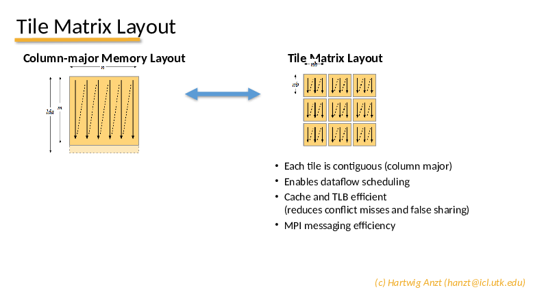
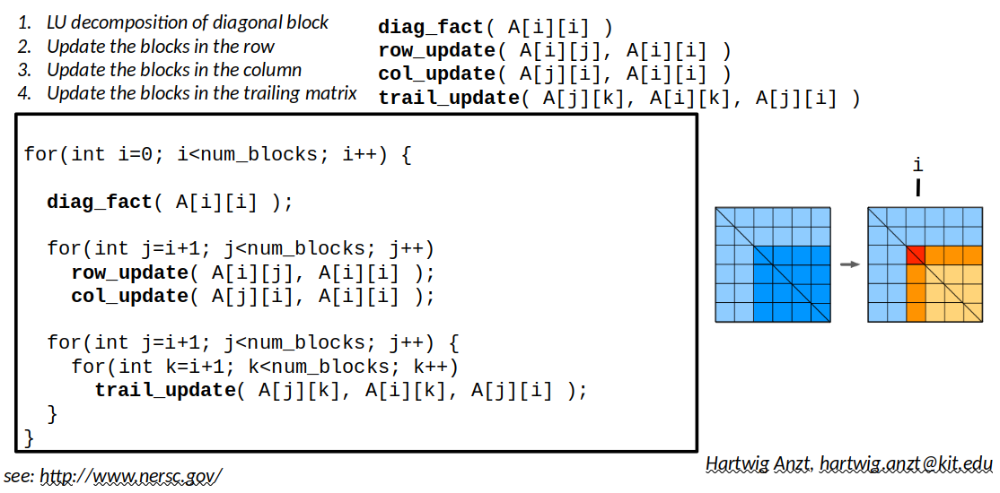

# Lab 1: Dense LU decomposition with OpenMP tasks

In this lab, we want to compute the LU decomposition of a dense matrix
on a shared-memory system (i.e., a multi-core CPU). You will use OpenMP
parallel loops and tasks to parallelize this important numerical algorithm.

## What you will practice here

- understanding block-wise algorithms for dense linear algebra
- Identifying data dependencies
- Task-based programming using OpenMP

## General remarks

- In the given code template, most OpenMP statements need to be inserted, but a
working sequential LU decomposition is provided, as well as a framework for testing
and benchmarking the code. 
- The matrix is stored as a 2D "grid" of tiles (or "blocks"):  

- The grid is represented as a ``std::vector<std::vector<block>>`` in column-major order,
so the block in row ``i`` and column ``j`` is accessed by ``blocks[i][j]``. The block itself
is stored as a 1D array (i.e., ``std::vector<float>``), and the element in row ``i`` and column ``j``
is accessed using index arithmetic: ``block[j*n+i]``.
- If at any point you get stuck or run out of time, you may look for inspiration
in the PDF file and/or in the solution/ subfolder.
- This [OpenMP cheatsheet](https://www.openmp.org/wp-content/uploads/OpenMP-4.0-C.pdf) may come in handy...


## Think before you code...

In order to understand the three operations required, 
take a moment with pen and paper to determine the values
of $`L_{21}`$, $`U_{12}`$ and $`S`$ (the Schur complement)
when factoring a $`2\times 2`$ block matrix

```math
\left ( \begin{array}{cc}
        A_{11} & A_{12} \\
        A_{21} & A_{22} 
\end{array} \right ) = 
\left (
\begin{array}{cc}
        L_{11} & 0 \\
        L_{21} & I 
\end{array} \right )
\left (
\begin{array}{cc}
        U_{11} & U_{12} \\
         0 & S 
\end{array} \right ).
```
The next step would then to factor $`S = L_{22}\cdot U_{22}`$.

## The algorithm



## Setup on DelftBlue

- load the Intel compilers and libraries using
  ``module load 2022r2 intel/oneapi-all``
- type 'make' to compile the code
- type ``sbatch run-task_lu.slurm`` to submit a job, the result will be written to ``slurm-<jobid>.out``

## Your tasks

1. Look through the program code ``task_lu.cpp`` to understand its structure.
   In particular, go through the block-wise LU decomposition algorithm in ``factorize_loop_parallelized``
   and understand how it uses the three building blocks ``diag_fact``, ``row_update``, ``col_update`` and ``trail_update``
   to implement the algorithm.
2. Following the comments in ``factorize_loop_parallelized``, insert OpenMP pragma's to achieve shared-memory parallelization.
   Set the macro ``BENCH_FACTORIZE`` to 1 to benchmark the parallel code.
3. Now insert OpenMP task pragma's in ``factorize_task_parallelized`` to expose the parallelism available in the algorithm to the
   OpenMP runtime. Be careful to specify all dependencies to avoid so-called race conditions!
   To benchmark this version, set ``BENCH_FACTORIZE`` to 2 before compiling and running the code

